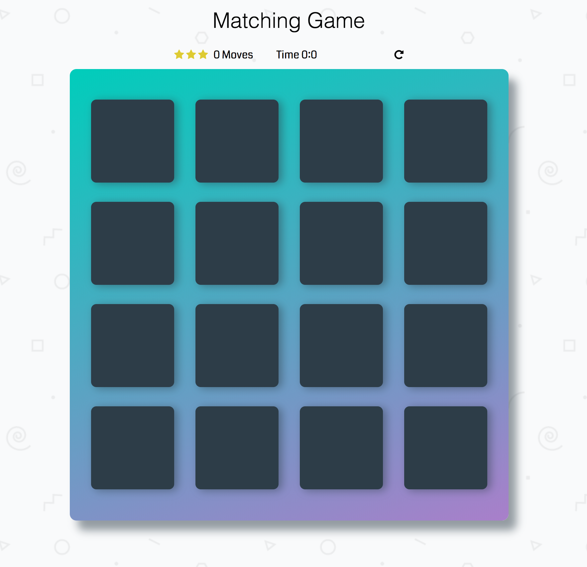

# Udacity Memory Game

This is the tipical game of memory we played as children, and is great for your brain. 

## Objective
Match identical cards in less time with less moves. Click on a card and try to remember it while you open others until you get a matching card. When you get all the pairs of matching cards a windows will open congratulating you and giving you the statistics of your game. Lets Play

## How I built the Memory Game
I manipulated the DOM with Vanilla JS, altered part of the HTML and also styled the game
* created a deck of cards that shuffles when game is refreshed
* created a counter to count the number of moves made by player and timer to know the duration of a play
* added effects to cards when they match and are unmatched
* create a pop-up modal when player wins game
